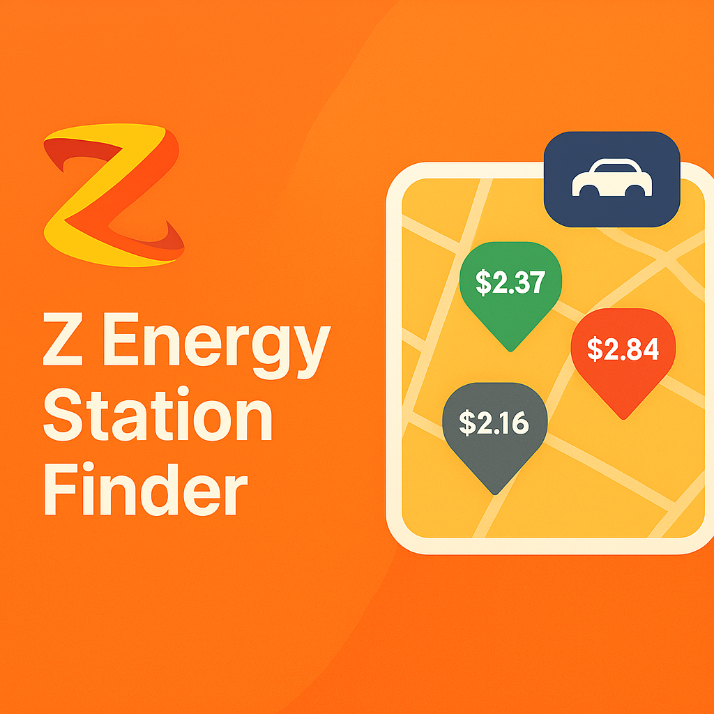

<!-- Improved compatibility of back to top link: See: https://github.com/othneildrew/Best-README-Template/pull/73 -->

<a id="readme-top"></a>

<!--
*** Thanks for checking out the Best-README-Template. If you have a suggestion
*** that would make this better, please fork the repo and create a pull request
*** or simply open an issue with the tag "enhancement".
*** Don't forget to give the project a star!
*** Thanks again! Now go create something AMAZING! :D
-->

<!-- PROJECT SHIELDS -->
<!--
*** I'm using markdown "reference style" links for readability.
*** Reference links are enclosed in brackets [ ] instead of parentheses ( ).
*** See the bottom of this document for the declaration of the reference variables
*** for contributors-url, forks-url, etc. This is an optional, concise syntax you may use.
*** https://www.markdownguide.org/basic-syntax/#reference-style-links
-->
<div align="center">

[![Contributors][contributors-shield]][contributors-url]
[![Forks][forks-shield]][forks-url]
[![Stargazers][stars-shield]][stars-url]
[![Issues][issues-shield]][issues-url]
[![License][license-shield]][license-url]
[![LinkedIn][linkedin-shield]][linkedin-url]

</div>
<!-- PROJECT LOGO -->
<br />
<div align="center">
  <a href="https://github.com/tonkatommy/MRHQ-L5-Mission-5-Phase-2-Backend">
    
  </a>

<h3 align="center">Z Energy Station Finder - Backend API</h3>

  <p align="center">
    RESTful API backend for the Z Energy Station Finder application, providing station data, filtering capabilities, and MongoDB integration.
    <br />
    <a href="https://github.com/tonkatommy/MRHQ-L5-Mission-5-Phase-2-Backend"><strong>Explore the docs »</strong></a>
    <br />
    <br />
    <a href="https://github.com/tonkatommy/MRHQ-L5-Mission-5-Phase-2-Backend">View Demo</a>
    &middot;
    <a href="https://github.com/tonkatommy/MRHQ-L5-Mission-5-Phase-2-Backend/issues/new?labels=bug&template=bug-report---.md">Report Bug</a>
    &middot;
    <a href="https://github.com/tonkatommy/MRHQ-L5-Mission-5-Phase-2-Backend/issues/new?labels=enhancement&template=feature-request---.md">Request Feature</a>
  </p>
</div>

<!-- TABLE OF CONTENTS -->
<details>
  <summary>Table of Contents</summary>
  <ol>
    <li>
      <a href="#about-the-project">About The Project</a>
      <ul>
        <li><a href="#built-with">Built With</a></li>
      </ul>
    </li>
    <li>
      <a href="#getting-started">Getting Started</a>
      <ul>
        <li><a href="#prerequisites">Prerequisites</a></li>
        <li><a href="#installation">Installation</a></li>
      </ul>
    </li>
    <li><a href="#usage">Usage</a></li>
    <li><a href="#roadmap">Roadmap</a></li>
    <li><a href="#contributing">Contributing</a></li>
    <li><a href="#license">License</a></li>
    <li><a href="#contact">Contact</a></li>
    <li><a href="#acknowledgments">Acknowledgments</a></li>
  </ol>
</details>

<!-- ABOUT THE PROJECT -->

## About The Project

The Z Energy Station Finder Backend is a robust Node.js/Express API that powers the Z Energy Station Finder application. Built as part of Mission Ready HQ's Level 5 Advanced Development course (Phase 2), this backend provides comprehensive data management and filtering capabilities for Z Energy fuel stations across New Zealand.

### Key Features

- **RESTful API Architecture**: Clean, organized endpoints following REST principles
- **MongoDB Integration**: Efficient NoSQL database for station data storage and retrieval
- **Advanced Filtering**: Complex query handling for services, fuel types, and station types
- **CORS Enabled**: Configured for seamless frontend integration
- **Data Seeding**: Automated database seeding with comprehensive station data
- **Mongoose Models**: Well-structured schemas for data validation and consistency
- **Real-time Data**: Fast query responses with optimized MongoDB queries

### API Endpoints

- `GET /` - Health check endpoint
- `GET /api/z-stations` - Retrieve all Z Energy stations
- `POST /api/filter-stations` - Filter stations by services, fuel type, and station type

### Database Schema

The ZStations model includes:

- Station name and address
- GPS coordinates (lat/lng)
- Opening hours
- Key services with icons (Car Wash, LPG, Food & Drink, Trailer Hire)
- Additional services array
- Fuel types available
- Station type (Truck Stop, EV Charging)
- Fuel prices (Z91, ZPremium, ZDiesel)

<p align="right">(<a href="#readme-top">back to top</a>)</p>

### Built With

- [![Node.js][Node.js]][Node-url] - JavaScript runtime environment
- [![Express.js][Express.js]][Express-url] - Fast, unopinionated web framework
- [![MongoDB][MongoDB]][MongoDB-url] - NoSQL database for flexible data storage
- [![Mongoose][Mongoose]][Mongoose-url] - MongoDB object modeling for Node.js
- [![JavaScript][JavaScript]][JavaScript-url] - Core programming language

<p align="right">(<a href="#readme-top">back to top</a>)</p>

<!-- GETTING STARTED -->

## Getting Started

Follow these instructions to set up the backend API locally for development and testing.

### Prerequisites

Ensure you have the following installed on your system:

- **Node.js** (v18 or higher recommended)
  ```sh
  node --version
  ```
- **npm** (comes with Node.js)
  ```sh
  npm --version
  ```
- **MongoDB** (v6.0 or higher)
  - [Download MongoDB Community Server](https://www.mongodb.com/try/download/community)
  - Or use [MongoDB Atlas](https://www.mongodb.com/cloud/atlas) for cloud hosting
  ```sh
  mongod --version
  ```

### Installation

1. **Clone the repository**

   ```sh
   git clone https://github.com/tonkatommy/MRHQ-L5-Mission-5-Phase-2-Backend.git
   cd MRHQ-L5-Mission-5-Phase-2-Backend
   ```

2. **Install dependencies**

   ```sh
   npm install
   ```

3. **Set up MongoDB**

   Make sure MongoDB is running on your local machine:

   ```sh
   # On Windows (if MongoDB is installed as a service, it should start automatically)
   # Otherwise, start it manually:
   mongod

   # On macOS (with Homebrew)
   brew services start mongodb-community

   # On Linux
   sudo systemctl start mongod
   ```

4. **Configure environment variables**

   Create a `.env` file in the root directory:

   ```env
   MONGO_URI=mongodb://localhost:27017/ZStations
   ```

   For MongoDB Atlas (cloud), use your connection string:

   ```env
   MONGO_URI=mongodb+srv://<username>:<password>@cluster.mongodb.net/ZStations
   ```

5. **Seed the database** (First time setup)

   The database seeding can be done by running the seed script:

   ```sh
   node database/seed.js
   ```

   This will populate your MongoDB with Z Energy station data.

6. **Start the development server**

   ```sh
   npm run dev
   ```

   Or for production:

   ```sh
   npm start
   ```

7. **Verify the server is running**

   Open your browser or use a tool like Postman to check:

   ```
   http://localhost:3000
   ```

   You should see: `{"message": "The backend is connected"}`

<p align="right">(<a href="#readme-top">back to top</a>)</p>

<!-- USAGE EXAMPLES -->

## Usage

### API Endpoints

#### 1. Health Check

```http
GET http://localhost:3000/
```

**Response:**

```json
{
  "message": "The backend is connected"
}
```

#### 2. Get All Stations

```http
GET http://localhost:3000/api/z-stations
```

**Response:** Array of all Z Energy stations

```json
[
  {
    "_id": "...",
    "stationName": "Z Petone",
    "stationAddress": "Jackson Street, Petone, Lower Hutt",
    "coordinates": {
      "lat": -41.2274,
      "lng": 174.8757
    },
    "openingHours": "24/7",
    "keyServices": {
      "keyServiceLabel": ["Car Wash", "Food & Drink"],
      "keyServicesIcon": ["carwash.svg", "foodDrink.svg"]
    },
    "services": ["ATM", "Paywave"],
    "fuelType": ["Z91 Unleaded", "ZX Premium", "Z Diesel"],
    "stationType": "Service Station",
    "fuelPrices": {
      "Z91": 2.45,
      "ZPremium": 2.75,
      "ZDiesel": 2.15
    }
  }
]
```

#### 3. Filter Stations

```http
POST http://localhost:3000/api/filter-stations
Content-Type: application/json
```

**Request Body:**

```json
{
  "services": ["Car Wash", "LPG swap & go"],
  "fuelType": "Z Diesel",
  "stationType": "Truck Stop"
}
```

**Response:** Filtered array of stations matching the criteria

### Filter Parameters

- **services** (array): Filter by available services

  - `"Car Wash"`
  - `"LPG swap & go"`
  - `"Food & Drink"`
  - `"Trailer Hire"`

- **fuelType** (string): Filter by fuel type availability

  - `"Z91 Unleaded"`
  - `"ZX Premium"`
  - `"Z Diesel"`

- **stationType** (string): Filter by station type
  - `"Truck Stop"`
  - `"EV Charging"`
  - `"Service Station"`

### Integration with Frontend

The backend is designed to work seamlessly with the [frontend application](https://github.com/tonkatommy/MRHQ-L5-Mission-5-Phase-2-Frontend). Ensure CORS is properly configured in `server.js` to match your frontend URL:

```javascript
app.use(
  cors({
    origin: "http://localhost:5173", // Your frontend URL
  })
);
```

<p align="right">(<a href="#readme-top">back to top</a>)</p>

<!-- ROADMAP -->

## Roadmap

- [x] RESTful API with Express.js
- [x] MongoDB integration with Mongoose
- [x] Station data model and schema
- [x] GET endpoint for all stations
- [x] POST endpoint for filtered stations
- [x] Database seeding functionality
- [x] CORS configuration
- [ ] Authentication and authorization
- [ ] Rate limiting and API throttling
- [ ] Caching layer (Redis)
- [ ] Pagination for large datasets
- [ ] API documentation (Swagger/OpenAPI)
- [ ] Unit and integration tests
- [ ] Logging and monitoring
- [ ] Docker containerization
- [ ] CI/CD pipeline

See the [open issues](https://github.com/tonkatommy/MRHQ-L5-Mission-5-Phase-2-Backend/issues) for a full list of proposed features (and known issues).

<p align="right">(<a href="#readme-top">back to top</a>)</p>

<!-- CONTRIBUTING -->

## Contributing

Contributions are what make the open source community such an amazing place to learn, inspire, and create. Any contributions you make are **greatly appreciated**.

If you have a suggestion that would make this better, please fork the repo and create a pull request. You can also simply open an issue with the tag "enhancement".
Don't forget to give the project a star! Thanks again!

1. Fork the Project
2. Create your Feature Branch (`git checkout -b feature/AmazingFeature`)
3. Commit your Changes (`git commit -m 'Add some AmazingFeature'`)
4. Push to the Branch (`git push origin feature/AmazingFeature`)
5. Open a Pull Request

### Development Guidelines

- Follow RESTful API design principles
- Use async/await for asynchronous operations
- Maintain consistent error handling
- Add comments for complex logic
- Test endpoints thoroughly before submitting PR
- Update API documentation for any endpoint changes

<p align="right">(<a href="#readme-top">back to top</a>)</p>

### Top contributors:

<a href="https://github.com/tonkatommy/MRHQ-L5-Mission-5-Phase-2-Backend/graphs/contributors">
  
</a>

<!-- LICENSE -->

## License

Distributed under the ISC License. See `LICENCE.txt` for more information.

<p align="right">(<a href="#readme-top">back to top</a>)</p>

<!-- CONTACT -->

## Contact

Tommy Goodman - [@tonkatommy](https://github.com/tonkatommy) |
LinkedIn: [https://linkedin.com/in/tgnz](https://linkedin.com/in/tgnz)  
Ben Mina - [@BenTomMina](https://github.com/BenTomMina)

Project Link: [https://github.com/tonkatommy/MRHQ-L5-Mission-5-Phase-2-Backend](https://github.com/tonkatommy/MRHQ-L5-Mission-5-Phase-2-Backend)  
Frontend Repository: [https://github.com/tonkatommy/MRHQ-L5-Mission-5-Phase-2-Frontend](https://github.com/tonkatommy/MRHQ-L5-Mission-5-Phase-2-Frontend)

<p align="right">(<a href="#readme-top">back to top</a>)</p>

<!-- ACKNOWLEDGMENTS -->

## Acknowledgments

- [Mission Ready HQ](https://missionreadyhq.com) - For providing the Level 5 Advanced Development course
- [Z Energy](https://www.z.co.nz) - For the project inspiration
- [Express.js](https://expressjs.com) - Fast, unopinionated web framework
- [MongoDB](https://www.mongodb.com) - NoSQL database solution
- [Mongoose](https://mongoosejs.com) - Elegant MongoDB object modeling
- [Best-README-Template](https://github.com/othneildrew/Best-README-Template) - For the README structure

<p align="right">(<a href="#readme-top">back to top</a>)</p>

## Project Structure

```
MRHQ-L5-Mission-5-Phase-2-Backend/
├── database/
│   ├── ZStations.js      # Mongoose model/schema
│   ├── seed.js           # Database seeding script
│   ├── seedData.js       # Station data for seeding
│   └── icons.js          # Icon mappings
├── .env                  # Environment variables (not in repo)
├── .gitignore
├── server.js             # Main application file
├── package.json
├── LICENCE.txt
└── README.md
```

### Key Files

- **server.js**: Main Express application with API endpoints and MongoDB connection
- **database/ZStations.js**: Mongoose schema defining the station data structure
- **database/seed.js**: Script to populate MongoDB with initial station data
- **database/seedData.js**: Comprehensive station data for New Zealand Z Energy locations

<p align="right">(<a href="#readme-top">back to top</a>)</p>

<!-- MARKDOWN LINKS & IMAGES -->
<!-- https://www.markdownguide.org/basic-syntax/#reference-style-links -->

[contributors-shield]: https://img.shields.io/github/contributors/tonkatommy/MRHQ-L5-Mission-5-Phase-2-Backend.svg?style=flat
[contributors-url]: https://github.com/tonkatommy/MRHQ-L5-Mission-5-Phase-2-Backend/graphs/contributors
[forks-shield]: https://img.shields.io/github/forks/tonkatommy/MRHQ-L5-Mission-5-Phase-2-Backend.svg?style=flat
[forks-url]: https://github.com/tonkatommy/MRHQ-L5-Mission-5-Phase-2-Backend/network/members
[stars-shield]: https://img.shields.io/github/stars/tonkatommy/MRHQ-L5-Mission-5-Phase-2-Backend.svg?style=flat
[stars-url]: https://github.com/tonkatommy/MRHQ-L5-Mission-5-Phase-2-Backend/stargazers
[issues-shield]: https://img.shields.io/github/issues/tonkatommy/MRHQ-L5-Mission-5-Phase-2-Backend.svg?style=flat
[issues-url]: https://github.com/tonkatommy/MRHQ-L5-Mission-5-Phase-2-Backend/issues
[license-shield]: https://img.shields.io/github/license/tonkatommy/MRHQ-L5-Mission-5-Phase-2-Backend.svg?style=flat
[license-url]: https://github.com/tonkatommy/MRHQ-L5-Mission-5-Phase-2-Backend/blob/master/LICENCE.txt
[linkedin-shield]: https://img.shields.io/badge/-LinkedIn-black.svg?style=flat&logo=linkedin&colorB=555
[linkedin-url]: https://linkedin.com/in/tgnz
[product-screenshot]: readme-images/screenshot.png
[Node.js]: https://img.shields.io/badge/Node.js-339933?style=for-the-badge&logo=nodedotjs&logoColor=white
[Node-url]: https://nodejs.org/
[Express.js]: https://img.shields.io/badge/Express.js-000000?style=for-the-badge&logo=express&logoColor=white
[Express-url]: https://expressjs.com/
[MongoDB]: https://img.shields.io/badge/MongoDB-47A248?style=for-the-badge&logo=mongodb&logoColor=white
[MongoDB-url]: https://www.mongodb.com/
[Mongoose]: https://img.shields.io/badge/Mongoose-880000?style=for-the-badge&logo=mongoose&logoColor=white
[Mongoose-url]: https://mongoosejs.com/
[JavaScript]: https://img.shields.io/badge/JavaScript-F7DF1E?style=for-the-badge&logo=javascript&logoColor=black
[JavaScript-url]: https://developer.mozilla.org/en-US/docs/Web/JavaScript
